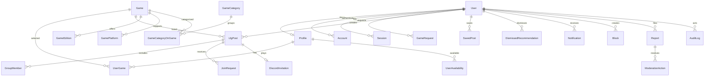
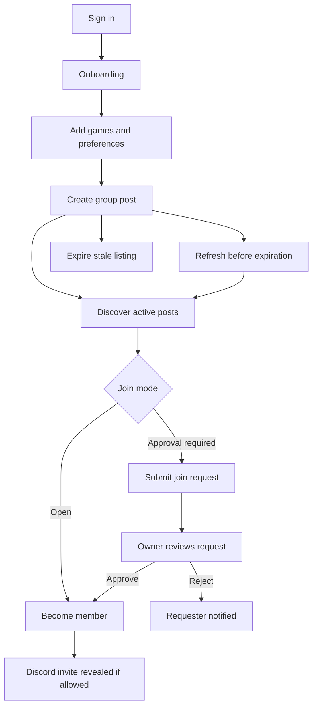

# ReadyLobby Architecture Notes

ReadyLobby uses Next.js App Router, Auth.js, Prisma, PostgreSQL, Zod, server actions, and focused domain services. The UI is intentionally separate from matching, expiration, Discord invitation validation, authorization, notification, and rate-limit logic.

## Data Model

## Primary User Flow

## Future Adapters

The game catalog is local-first and can later receive IGDB, RAWG, or verified Steam data through an adapter. New group posts and profile game preferences must reference an approved, active, listing-enabled `Game` by ID; unlisted names flow through `GameRequest` for administrator review. The initial Steam-ranked co-op list is captured seed metadata dated July 28, 2026, not a live ranking. Discord communication is invite-based today, with model boundaries prepared for a future bot that could create temporary channels, roles, or membership sync.

